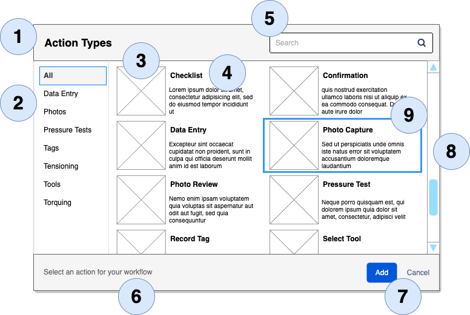
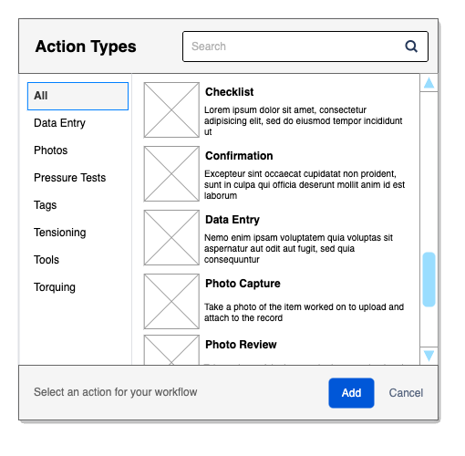

# Overview

The catalog dialog is a modal dialog that allows
users to select an item from a categorized list
of available items.

We intend to use this dialog in the Workflow Builder
for the user to select a new step to add to their
workflow operation. It also has the potential to
support the addition of a new tool to the user's
tool inventory.

# Requirement Overview

## Two Column Layout
This is the default layout for the dialog.



| No.   | Requirement      | Description                                               |
|-------|------------------|-----------------------------------------------------------|
| **1** | Dialog Title     | This should be an input property for the dialog           |
| **2** | Categories       | Should be configurable by a list of categories.           |
| **3** | Large Icon       | An icon for a catalog item.                               |
| **4** | Item Description | A title and description for the catalog item.             |
| **5** | Search box       | Filters the catalog items by the search terms.            |
| **6** | Prompt text      | Optional prompt set as an input property                  |
| **7** | Add / Cancel     | The labels should be configurable as input properties.    |
| **8** | Vertical Scroll  | Visible if there are more items than fit in the viewport. |
| **9** | Selected Item    | The selected item is indicated with an outline.           |

## One Column Layout

The caller can specify a single column layout for the dialog.

This version of the dialog has all the same capabilities as the two
column layout.



## Catalog Configuration

The following types define the input configuration:

```typescript
type CategoryItemId = string;
type TagId = string;

type CategoryItem = {
    id: CategoryItemId;
    name: string;
    description: string;
    icon?: string | null;
    tags: TagId[];
    category: CategoryId
}

type CategoryId = string;

type Category = {
    id: CategoryId
    name: string
}

type Tag = {
    id: TagId
    primary: string
    aliases: string[]
}

type CatalogConfig = {
    title: string
    categories: Category[]
    items: CategoryItem[]
    tags: Tag[]
    prompt?: string
    actions: {
        add: string
        cancel: string
        callback: (item: CategoryItemId | null) => void
    },
    columns?: 1 | 2
}

type CatalogPayload = {
    categories: Category[]
    items: CategoryItem[]
    tags: Tag[]
}
```

## Requirement Details

| No.       | Requirement                                                                                                                  |
|-----------|------------------------------------------------------------------------------------------------------------------------------|
| **1.1**   | Use a bold font                                                                                                              |
| -----     |                                                                                                                              |
| **2.1**   | The catalog config input has a list of categories                                                                            |
| **2.2**   | The categories are sorted alphabetically                                                                                     |
| **2.3**   | The "All" category appears at the top                                                                                        |
| **2.4.1** | A single category can be selected at a time                                                                                  |
| **2.4.2** | The default category should be "All"                                                                                         |
| **2.4.3** | When selected, the only category items in that category are displayed                                                        |
| **2.5**   | Empty categories should be displayed in a non-selectable / disabled state                                                    |
| -----     |                                                                                                                              |
| **3.1**   | A category may have an icon                                                                                                  |
| **3.2**   | Icons for 2 column display are 80x80                                                                                         |
| **3.3**   | Icons for 1 column display are 60x60                                                                                         |
| -----     |                                                                                                                              |
| **4.1**   | A catalog item has a title and description                                                                                   |
| **4.2**   | The catalog item title is bold                                                                                               |
| **4.3**   | The catalog item description is on a separate line                                                                           |
| **4.4**   | The width of the catalog text description is 150px in the 2 col layout                                                       |
| **4.5**   | The width of the catalog text description is 230px in the 1 col layout                                                       |
| -----     |                                                                                                                              |
| **5.1**   | Search box should have placeholder text of `Search`                                                                          |
| **5.2**   | Any text in the search box is matched against the catalog item's title, description, and hidden tags                         |
| **5.3**   | Catalog items that don't match the search filter are removed from the display                                                |
| -----     |                                                                                                                              |
| **6.1**   | Additional text passed by the input config object. Currently static.                                                         |
| -----     |                                                                                                                              |
| **7.1**   | Label buttons are part of the input config for the dialog                                                                    |
| **7.2**   | The `Add` button should be a primary button and have a disabled state                                                        |
| **7.3**   | The `Add` button is disabled when there is no selection                                                                      |
| **7.4**   | When the `Add` button is clicked, the dialog is hidden and the registered callback is invoked with the selected catalog item |
| **7.5**   | The `Cancel` button is displayed w/o a border and is never disabled                                                          |
| **7.6**   | When the `Cancel` button is clicked, the dialog is hidden and the registered callback is invoked w/ a null.                  |
| -----     |                                                                                                                              |
| **8.1**   | The vertical scrollbar is displayed when there are more than 6 items in a 2 col display or 4 items in a single col display   |
| -----     |                                                                                                                              |
| **9.1**   | Single clicking on a catalog item marks it as selected and enables the `Add` button                                          |
| **9.2**   | Double clicking on a catalog item closes the dialog and invokes the registered callback with the selected catalog item       |
